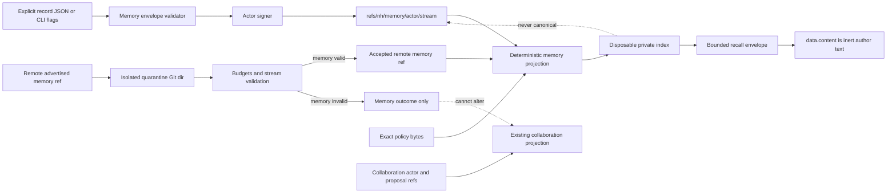

# Implementation Plan: Agent Memory Protocol

**Branch**: `feat/agent-memory-protocol` | **Date**: 2026-08-30 | **Spec**: [spec.md](spec.md)
**Input**: Give agents durable, distributed, signed project memory without turning recalled text into trusted instructions.

## Summary

Add a repository-native memory bounded context beside Nichthub's existing
collaboration protocol. Memory uses independent signed stream refs and a new
`nh-memory/0` envelope, while reusing actor identities and extending the
selected quarantine transport with an independently failing memory selector.
The CLI records explicit structured claims, projects immutable lifecycle facts,
builds a disposable deterministic local index, and returns bounded JSON recall
envelopes whose author text is structurally inert.

The existing collaboration `Event` wire shape and refs remain unchanged.
Memory is optional: a repository with no memory policy, refs, or index behaves
exactly as it did before this mission.

## Technical Context

**Language/Version**: Go 1.26
**Primary Dependencies**: Go standard library; Git CLI; existing optional Bubblewrap behavior is unaffected
**Storage**: Signed JSON and signatures in Git commit trees; private rebuildable JSON index below `.git/nh/memory/`
**Testing**: Go unit, permutation/property-style fixtures, public CLI integration, bare-remote replication, shallow/failure injection, race detector
**Target Platform**: Git-capable Linux/macOS/Windows for protocol and recall; no new platform-specific runtime dependency
**Project Type**: Single native CLI at repository root
**Performance Goals**: 10,000-record clean index rebuild under 30 seconds; indexed exact and lexical recall under 1 second p95 on the development host
**Constraints**: No service, Docker, model API, vector database, automatic transcript capture, or canonical mutable database; default recall at most 20 records and 65,536 content bytes
**Scale/Scope**: Version-0 repository-local memory, six record kinds, four operations, independent selected streams, fresh-clone convergence

## Charter Check

| Charter requirement | Plan response | Gate |
| --- | --- | --- |
| Native Go CLI; standard library first | New behavior is Go code in the existing binary with no dependency addition | Pass |
| Git remains content store and transport | Signed memory stream commits and refs are canonical; index is disposable | Pass |
| No mandatory service, GitHub workflow, or Docker | Record, sync, index, and recall operate with local Git only | Pass |
| Fetched data and execution are hostile | Memory is separately selected, quarantined, bounded, strictly decoded, and inert on recall | Pass |
| Signed history is immutable | Supersede, retract, and challenge append facts; no memory payload is edited | Pass |
| Observable behavior tested publicly | CLI, temporary remotes, fresh clones, hostile fixtures, and crash boundaries are acceptance surfaces | Pass |
| Wire and trust changes update docs | Protocol, policy, replication, safety, operator, and adapter docs ship in the mission | Pass |

No charter violation requires a complexity exception.

## Architecture and trust boundaries



Checkable isolation rules:

1. `collectEvents` never enumerates memory refs.
2. Memory collection never requires collaboration actor refs.
3. A memory request produces its own replication outcome and promotion.
4. Only verified accepted/local memory refs feed projection and index rebuild.
5. Policy qualification, evidence status, applicability, lifecycle, and
   signature status are distinct response fields.
6. Recall has no path to command execution, authorization, event append, ref
   mutation, network access, or adapter callbacks.

## Bounded contexts and interfaces

### Collaboration context (existing)

Owns `Event`, actor chains, issues, proposals, reviews, CI, decisions, and
merges. It exposes read-only exact-event resolution to memory evidence checks.
Its public wire format is frozen for this mission.

### Memory context (new core domain)

Owns the memory envelope, stream chain, record kinds, lifecycle relationships,
applicability, evidence classification, trust classification, recall request,
and recall envelope. Its canonical state is signed Git data.

### Replication context (existing supporting domain)

Gains a memory selector adapter that translates advertised memory refs into the
existing quarantine transaction concepts. It does not interpret recall or
author content.

### Policy context (existing supporting domain)

Gains an optional memory qualification section and exposes an exact-commit
classification function. It does not declare memories true or active.

### Index context (new supporting projection)

Consumes verified memory projection rows and produces a deterministic private
JSON cache and lexical token map. It can be deleted without information loss.

## Data flow

### Recording

1. Parse either human flags or a versioned JSON request into one internal input.
2. Resolve the exact Git anchor and optional path/blob pairs without mutation.
3. Validate kind-specific fields, normalized topics, evidence IDs, UTF-8, and
   all record bounds.
4. Load the selected actor identity and current stream head.
5. Build, encode, sign, and append one parent-linked memory commit with
   compare-and-swap ref update.
6. Print the full memory and stream IDs in JSON or safe human output.
7. Leave any existing index stale; canonical append success does not depend on
   index I/O.

### Lifecycle projection

1. Verify every selected stream independently.
2. Build a map of record-producing memory IDs.
3. Validate same-author supersession/retraction and cross-author challenges.
4. Preserve missing targets as explicit dependency rows.
5. Sort edges and derive summary lifecycle states without delivery-order input.

### Recall

1. Normalize and validate a versioned query and positive bounds.
2. Load exact requested policy bytes and compute accepted-ref fingerprint.
3. Verify or rebuild the disposable index without network access.
4. Evaluate commit/path/subject applicability and exact evidence resolution.
5. Apply exact filters, then deterministic lexical token intersection.
6. Sort by stable keys, apply cursor, count bound, and encoded-content bound.
7. Emit one JSON envelope with a constant inert-data warning, provenance, full
   classifications, missing dependencies, and continuation metadata.

### Replication

1. Discover only explicitly selected full memory stream IDs, or all advertised
   memory refs under compatibility `--all`.
2. Fetch each requested ref into an isolated quarantine repository.
3. Measure existing transaction budgets before trust-bearing validation.
4. Strictly validate ref owner, exact tree shape, signatures, stream continuity,
   record bounds, and available lifecycle dependencies.
5. Promote independently valid memory refs atomically alongside, but not
   coupled to, valid actor/proposal outcomes.
6. Record exact missing dependencies for explicit shallow recovery; never call
   them valid or evidence-resolved prematurely.

## Project Structure

### Documentation and contracts

```text
kitty-specs/agent-memory-protocol-01M19TMH/
├── spec.md
├── research.md
├── data-model.md
├── plan.md
├── quickstart.md
├── contracts/
│   ├── memory-wire-v0.md
│   ├── memory-cli-v0.md
│   └── memory-replication-v0.md
├── research/
│   ├── evidence-log.csv
│   └── source-register.csv
└── tasks/                 # generated by the task phase

docs/
├── memory-v0.md           # public protocol, lifecycle, policy, index
├── memory-safety.md       # prompt-injection, privacy, trust threat model
├── replication-v0.md      # memory selection and quarantine extension
├── protocol-v0.md         # boundary/link to separate memory protocol
└── host-compatibility.md  # memory ref transport and limits
```

### Source and tests

```text
memory_event.go            # envelope, bounds, canonical signing/verification
memory_event_test.go
memory_store.go            # stream refs, append/load/collect, chain validation
memory_store_test.go
memory_projection.go       # lifecycle, applicability, evidence, trust
memory_projection_test.go
memory_index.go            # source fingerprint, rebuild, verify, lexical query
memory_index_test.go
memory_commands.go         # record/show/lifecycle/recall/index CLI
memory_commands_test.go
policy.go                  # optional MemoryPolicy and validation
replication.go             # saved memory selectors
quarantine.go              # memory request adapter and independent promotion
shallow.go                 # exact memory dependency classification/recovery
commands.go                # publication of local memory refs
main.go                    # `nh memory` command routing and usage
memory_replication_test.go # mixed hostile remote and fresh-clone behavior
memory_acceptance_test.go  # black-box handoff, inert content, performance proof
```

**Structure Decision**: Retain the repository's flat Go package because the
existing CLI is one cohesive `main` package and the new files create deep
behavioral modules without adding import cycles or artificial packages. Tests
remain adjacent to the public behavior they protect.

## Compatibility and migration

- No existing JSON field, event kind, ref name, or public event ID changes.
- `PolicyDocument.Memory` is optional. Existing policy bytes remain valid and
  mean no memory qualifies for default recall.
- `ReplicationSelection.Memories` uses `omitempty`; saved version-1 selections
  without it decode and round-trip with their current meaning.
- Repositories gain no tracked migration. `.git/nh/memory` is created lazily
  with existing private-directory helpers.
- Local actor identities are reused; no key copy or new secret format is added.
- `--all` discovers memory refs after upgrade, consistent with its documented
  compatibility-all meaning. Explicit actor/proposal selections import no
  memory unless `--memory` is present.
- Index format is explicitly local version 0 and may be rebuilt rather than
  migrated if incompatible.

## Implementation strategy

Implementation is acceptance-test-first and proceeds through dependency-safe
vertical foundations:

1. Freeze public memory wire and CLI contracts with failing fixtures.
2. Implement bounded signed envelopes and separate stream storage.
3. Implement order-independent lifecycle and trust/evidence/applicability
   projection.
4. Implement record, lifecycle, handoff, show, and bounded JSON recall commands.
5. Implement deterministic private index and performance corpus.
6. Extend policy and selected quarantine replication with memory-only failure
   isolation and shallow dependency reporting.
7. Prove fresh-clone convergence, adversarial inert content, compatibility, and
   public documentation through one integrated operational scenario.

Each stage preserves a green collaboration-only baseline. Replication work does
not begin until standalone memory streams and their hostile validation fixtures
are stable.

## Implementation Concern Map

### IC-01 — Signed memory wire and bounds

- **Purpose**: Define stable canonical payloads, IDs, signatures, record kinds,
  lifecycle shapes, typed evidence, and hostile input limits.
- **Relevant requirements**: FR-001–FR-005, FR-010, FR-011, FR-021; NFR-001–NFR-004, NFR-009–NFR-011.
- **Affected surfaces**: `memory_event.go`, `memory_event_test.go`, `contracts/memory-wire-v0.md`.
- **Sequencing/depends-on**: none.
- **Risks**: Accidental acceptance of unknown JSON fields, ambiguous evidence,
  invalid UTF-8, or a wire choice that couples content to execution semantics.

### IC-02 — Independent stream storage

- **Purpose**: Append and verify actor-owned parent-linked memory chains under
  refs that collaboration collection never traverses.
- **Relevant requirements**: FR-006, FR-014–FR-017, FR-023; NFR-005, NFR-010.
- **Affected surfaces**: `memory_store.go`, `memory_store_test.go`, existing Git/private-state helpers.
- **Sequencing/depends-on**: IC-01.
- **Risks**: Ref/path confusion, concurrent append races, cross-stream
  predecessor acceptance, or collaboration wire regression.

### IC-03 — Deterministic projection and policy trust

- **Purpose**: Derive lifecycle, challenge, applicability, evidence, and exact
  policy classifications without conflating them.
- **Relevant requirements**: FR-008, FR-010, FR-012–FR-017, FR-022; NFR-001, NFR-005.
- **Affected surfaces**: `memory_projection.go`, `memory_projection_test.go`, `policy.go`, policy tests.
- **Sequencing/depends-on**: IC-01, IC-02.
- **Risks**: Delivery-order dependence, incorrect same-author enforcement,
  stale-policy trust, or hidden natural-language inference.

### IC-04 — Deliberate CLI and inert bounded recall

- **Purpose**: Provide human and stable machine record/recall interfaces,
  structured handoffs, exact filters, byte/count bounds, and safe output.
- **Relevant requirements**: FR-001–FR-005, FR-008–FR-013, FR-018, FR-020–FR-022; NFR-001–NFR-004, NFR-009, NFR-011.
- **Affected surfaces**: `memory_commands.go`, `memory_commands_test.go`, `main.go`, `contracts/memory-cli-v0.md`.
- **Sequencing/depends-on**: IC-01, IC-02, IC-03.
- **Risks**: Prompt-like content escaping its data field, cursor/query mismatch,
  unbounded JSON output, or human and machine paths diverging.

### IC-05 — Rebuildable deterministic index

- **Purpose**: Make exact and lexical recall fast while keeping all index state
  private, reproducible, verifiable, and disposable.
- **Relevant requirements**: FR-019, FR-020; NFR-007, NFR-008, NFR-009, NFR-011.
- **Affected surfaces**: `memory_index.go`, `memory_index_test.go`, `.git/nh/memory/index-v0.json`.
- **Sequencing/depends-on**: IC-03, IC-04.
- **Risks**: Index becoming silently authoritative, nondeterministic rebuilds,
  policy/ref staleness, permission failures, or quadratic query behavior.

### IC-06 — Independent hostile replication and shallow recovery

- **Purpose**: Select, quarantine, budget, validate, promote, publish, and
  explicitly recover memory streams without coupling collaboration outcomes.
- **Relevant requirements**: FR-006, FR-007, FR-022–FR-024; NFR-006, NFR-010–NFR-012.
- **Affected surfaces**: `replication.go`, `quarantine.go`, `shallow.go`, `commands.go`, `memory_replication_test.go`, `contracts/memory-replication-v0.md`.
- **Sequencing/depends-on**: IC-01, IC-02, IC-03.
- **Risks**: One invalid memory rolling back valid collaboration, objects
  bypassing quarantine, incomplete dependency closure, or misleading recovery.

### IC-07 — Operational proof and living documentation

- **Purpose**: Demonstrate two actors, hostile inert memory, correction,
  handoff, selective fresh-clone recall, index rebuild, and legacy compatibility.
- **Relevant requirements**: all FRs and NFRs; SC-001–SC-009.
- **Affected surfaces**: `memory_acceptance_test.go`, `README.md`, `docs/*.md`, mission quickstart and contracts.
- **Sequencing/depends-on**: IC-01–IC-06.
- **Risks**: Unit-only evidence, fixture-only adapters, performance gates that
  do not exercise the real index, or docs claiming stronger trust/erasure than
  the protocol provides.

## Test and quality gates

### Per-concern

- Wire and storage fixtures: `go test ./... -run 'TestMemory(Event|Stream)'`
- Projection permutations: `go test ./... -run TestMemoryProjection`
- CLI and inert recall: `go test ./... -run 'TestMemory(Command|Recall)'`
- Index and 10k corpus: `go test ./... -run TestMemoryIndex`
- Replication/shallow: `go test ./... -run TestMemoryReplication`
- Operational proof: `go test ./... -run TestOperationalAgentMemory`

### Mission acceptance

```text
gofmt -w <changed Go files>
git diff --check
go test ./...
go test -race ./...
go vet ./...
go build ./...
```

Acceptance additionally compares representative pre-memory event payload bytes
and IDs, runs projection permutations, deletes/rebuilds the index twice, checks
owner-only private state on Unix, measures the 10,000-record target, and runs a
credential-disabled fresh-clone round trip.

## Premortem and mitigations

| Failure mode | Early signal | Mitigation / required proof |
| --- | --- | --- |
| Memory silently joins collaboration chain | `collectEvents` count changes after a memory append | Explicit ref namespaces and regression fixture comparing all prior IDs |
| Recalled injection text gains authority | Output has prose outside nested data or a test adapter executes it | Constant warning, typed envelope, hostile controls/command fixtures, no execution dependency |
| Lifecycle differs by arrival order | Permuted fixture JSON differs | Set-based graph projection with sorted edges and byte-identical permutation tests |
| Index becomes canonical | Recall fails permanently when index deleted | Rebuild-on-missing path and delete/rebuild fresh-clone tests |
| Invalid memory blocks proposals/reviews | Mixed transaction loses a valid actor/proposal outcome | Per-request outcomes and mixed hostile remote acceptance test |
| Shallow absence becomes false trust | Missing anchor reports `resolved` | Exact dependency classification and explicit selected recovery action |
| Policy upgrade breaks old repositories | Existing `.nh/policy.json` rejected | Optional memory section and complete legacy regression suite |
| 10k performance misses target | Corpus test approaches threshold early | Keep optimization inside deterministic index; profile only after correctness |
| Published sensitive text cannot be erased | Docs imply retraction deletes objects | Deliberate-input warning and explicit no-erasure threat-model section |

## Planning gate result

The architecture satisfies all mission requirements without changing product
scope. Research has no unresolved blocker. Task decomposition should preserve
the seven implementation concerns, use independent lanes only where their
interfaces are contract-frozen, and place mixed replication plus operational
proof after the standalone memory core.
