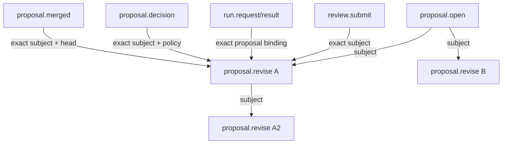
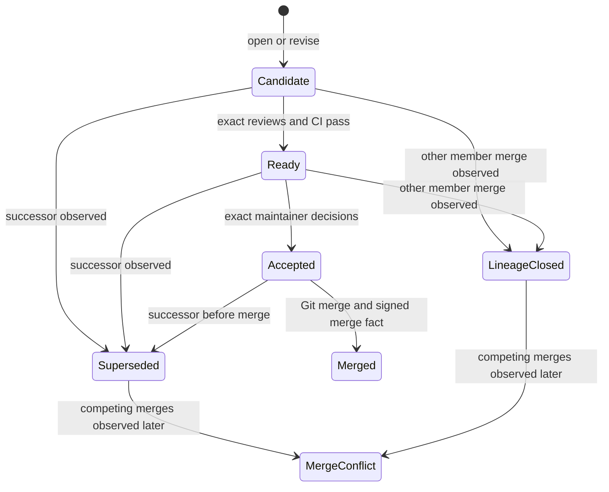

# Data Model: Proposal Revision and Conflict Recovery

## Signed Event Extension

### `proposal.revise`

| Field | Meaning | Invariant |
|---|---|---|
| `protocol` | Wire version | Exactly `nh/0` |
| `kind` | Event discriminator | Exactly `proposal.revise` |
| actor fields | Revision signer | Signature verifies and actor equals predecessor actor |
| actor chain fields | Author-local history | Existing positive sequence and exact previous-event rules |
| `subject` | Direct predecessor proposal ID | Valid exact event ID; resolves to `proposal.open` or `proposal.revise` |
| `base` | Newly selected policy/target base | Valid Git commit OID and different from `head` |
| `head` | Newly resolved code | Valid Git commit OID and different from `base` |
| `body` | Optional revision explanation | Untrusted display text; sanitized by existing output helpers |

The title is inherited from the predecessor at projection time. It is not copied
into the signed revision event, avoiding duplicate authoritative values.

## Proposal Candidate

A **ProposalCandidate** is a verified stored event whose kind is
`proposal.open` or `proposal.revise`.

Derived attributes:

- `ID`: SHA-256 protocol ID of exact signed payload bytes.
- `Predecessor`: empty for an open proposal; exact `subject` for a revision.
- `Title`: signed `title` for an open proposal; root/predecessor title for a
  revision.
- `CodeRef`: `refs/nh/proposals/<ID-without-prefix>`.
- `Evidence`: only events whose exact subject chain leads to this candidate.

## Revision Lineage Index

The index is ephemeral and reconstructed from verified events:

```text
LineageIndex
├── proposals: proposal ID -> ProposalCandidate
├── predecessor: revision ID -> direct predecessor ID
├── successors: proposal ID -> sorted direct successor IDs
├── merges: proposal ID -> sorted proposal.merged events
└── lineage queries: root, ancestors, descendants, siblings, merged members
```

All stored slices are sorted by full event ID. Graph traversal uses visited and
active sets to guarantee finite traversal and explicit cycle detection.

### Derived State

| State | Definition |
|---|---|
| candidate | Valid proposal with no known successor and no merge fact |
| superseded | Unmerged proposal with one or more known valid successors |
| merged | Proposal has at least one valid local merge event |
| lineage closed | Another member of the same lineage is known merged |
| merge conflict | Two or more distinct members of one lineage have valid merge facts |

`superseded`, `lineage closed`, and `merge conflict` are local projections, not
new signed events. They may change after synchronization while the underlying
facts remain immutable.

## Relationships and Invariants



1. Every revision has exactly one direct predecessor.
2. The predecessor must already be present in the verified local event set.
3. A revision signer must be the same actor as its predecessor signer; by
   induction, one author owns the entire lineage.
4. Local creation refuses a predecessor already known merged. Reception does
   not retroactively invalidate an otherwise valid revision merely because a
   merge fact is also present; no cross-actor authoritative ordering exists.
5. Self-links and cycles invalidate the relationship projection.
6. Multiple successors of one predecessor are siblings; none is current or
   latest by protocol semantics.
7. Evidence never traverses predecessor/successor edges.
8. Proposal code refs are immutable and must match the signed head.
9. A lineage may contain multiple merge facts after disconnected histories
   meet; this is reported rather than resolved automatically.

## State Transitions



Historical acceptance is still displayed after supersession, but it no longer
authorizes a new merge. State is recalculated from current verified facts.

## Failure Semantics

- **Malformed revision**: reject during event-content validation.
- **Missing or wrong-kind predecessor**: reject during relationship validation.
- **Unauthorized author**: reject relationship; event cannot enter projection.
- **Cycle/self-link**: reject relationship with involved exact ID.
- **Local revision of known merged predecessor**: refuse creation and direct the
  user to open an independent proposal.
- **Received revision plus merge fact**: preserve both valid signed facts and
  derive lineage-closed or merge-conflict state; do not infer real-world order
  from timestamps or delivery.
- **Missing/mismatched revision code ref**: retain signed proposal history but
  report code unavailable/mismatched; review/readiness remains blocked as today.
- **Proposal ref creation failure after event append**: report created event ID;
  existing refs/events remain unchanged and a retry may safely publish code.
- **Git merge conflict**: abort merge, restore clean worktree, and show the exact
  proposal ID usable as the predecessor for `nh proposal revise`.
- **Competing merge facts**: preserve both and report all merged member IDs.
