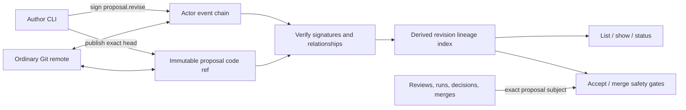

# Implementation Plan: Proposal Revision and Conflict Recovery

**Branch**: `chore/spec-kitty-bootstrap` | **Date**: 2026-08-29 | **Spec**: [spec.md](spec.md)
**Input**: Feature specification from `kitty-specs/proposal-revision-conflict-recovery-01M1774Q/spec.md`

## Summary

Add an immutable `proposal.revise` event that names one exact predecessor in
its `subject` field and carries a fresh exact base and head. A derived,
cycle-safe lineage index validates author ownership and produces predecessor,
successor, sibling, superseded, merged-lineage, and conflicting-merge views
without inventing a mutable latest pointer. Existing evidence continues to bind
exact proposal IDs, while acceptance and merge gain lineage-aware safety gates.

The protocol extension reuses the existing signed actor chain, Git object store,
proposal code refs, and synchronization path. It preserves the current
single-writer identity invariant: sibling successors are valid graph structure,
but publication from disconnected writers sharing one private identity is not
introduced by this mission.

## Technical Context

**Language/Version**: Go 1.26
**Primary Dependencies**: Go standard library and the installed Git CLI; no new dependency
**Storage**: Signed JSON events and attachments in Git objects; actor, proposal, and remote-tracking refs
**Testing**: Go unit and CLI integration tests using temporary repositories and bare remotes; `go test -race ./...`, `go vet ./...`, `go build ./...`
**Target Platform**: Native command-line client on platforms supported by the existing Go/Git prototype
**Project Type**: Single native CLI
**Performance Goals**: Proposal list, show, and status complete within 2 seconds for 10,000 events, 1,000 proposals, and 100 revision links
**Constraints**: Offline-capable; no hosted coordinator, service database, Docker requirement, mutable signed history, or implicit trust; hostile fetched data must fail closed
**Scale/Scope**: One protocol event kind, one derived lineage module, existing proposal/governance surfaces, documentation, and deterministic tests

## Charter Check

*GATE: Passed before research and re-checked after design.*

| Charter obligation | Design evidence | Result |
|---|---|---|
| Go CLI with narrow standard-library interfaces | `lineage.go` concentrates graph projection; existing CLI modules call it | Pass |
| Git remains store and transport | Revision events use actor chains and existing immutable proposal refs/refspecs | Pass |
| No mandatory service, Docker, or forge workflow | No dependency or deployment change | Pass |
| Fetched data is hostile | Shape, signature, relationship, author, acyclicity, and code-ref checks precede projection; merge state gates future local actions | Pass |
| Signed history is immutable | Recovery emits a successor; it never changes predecessor bytes or refs | Pass |
| Evidence binds exact inputs | Existing subject/head/policy/definition checks remain exact per revision ID | Pass |
| Public behavior is specified and tested | Contract, quickstart, protocol/governance docs, and temporary-remote tests cover the extension | Pass |
| TDD and quality gates | Every behavior package starts with failing tests and ends with all charter commands | Pass |

No charter exception or complexity waiver is required.

## Architecture and Data Flow



The signed event is the source of the predecessor relationship. The lineage
index is rebuilt from the complete locally verified event set and is never
persisted as authority. Event timestamps affect presentation only; proposal IDs
provide deterministic ordering where a stable display is required.

## Project Structure

### Documentation (this mission)

```text
kitty-specs/proposal-revision-conflict-recovery-01M1774Q/
├── plan.md
├── research.md
├── data-model.md
├── quickstart.md
├── contracts/
│   └── proposal-revision-v0.md
└── tasks/                    # generated in the task phase
```

### Source Code (repository root)

```text
event.go                      # signed event shape and content validation
store.go                      # Git persistence and cross-event validation
proposal.go                   # proposal open/revise/list/show and exact-ID UX
lineage.go                    # derived revision graph and lineage state
policy.go                     # exact evidence evaluation and status output
governance.go                 # acceptance and merge lineage gates
ci.go                         # revision-aware run request/validation
commands.go                   # unchanged Git ref synchronization boundary
*_test.go                     # unit and temporary-repository integration tests
README.md
docs/protocol-v0.md
docs/governance-v0.md
```

**Structure Decision**: Keep the repository's flat single-package Go layout.
The only new source module is `lineage.go`, a deep domain module that owns graph
validation and projections so proposal, CI, and governance commands do not each
reimplement lineage rules.

## Protocol Compatibility

- `proposal.open` bytes and meaning remain unchanged.
- `proposal.revise` is a new kind rather than an optional field on
  `proposal.open`. Existing clients therefore reject histories they cannot
  safely interpret instead of merging a superseded candidate.
- A revision uses the same immutable `refs/nh/proposals/<event-id>` code ref as
  an original proposal, so the fetch and push refspecs do not change.
- Histories without `proposal.revise` produce the same projection and command
  behavior as before.
- This is an intentional protocol-v0 additive extension, documented in the
  same mission; no stable-version compatibility promise exists yet.

## Implementation Concern Map

### IC-01 — Signed revision event and relationship validation

- **Purpose**: Define and verify the fail-closed `proposal.revise` wire contract before any event can affect local state.
- **Relevant requirements**: FR-001, FR-002, FR-003, FR-010, FR-013; NFR-002, NFR-004; C-001, C-002, C-003
- **Affected surfaces**: `event.go`, `store.go`, `event_test.go`, `proposal_test.go`
- **Sequencing/depends-on**: none
- **Risks**: Cross-event checks must be independent of arrival order; missing predecessors, non-author signers, self-links, and cycles must fail closed, while later merge facts must not retroactively erase a valid signed revision.

### IC-02 — Deterministic lineage projection

- **Purpose**: Centralize roots, predecessors, successors, siblings, superseded state, lineage merges, and merge conflicts behind one derived model.
- **Relevant requirements**: FR-004, FR-007, FR-008, FR-010, FR-011, FR-012; NFR-001, NFR-003; C-005
- **Affected surfaces**: `lineage.go`, `lineage_test.go`, `proposal.go`, `policy.go`
- **Sequencing/depends-on**: IC-01
- **Risks**: No timestamp-based winner or global latest may leak into semantics; traversal must be finite, deterministic, and linear in the local event set.

### IC-03 — Revision creation and proposal inspection

- **Purpose**: Add `nh proposal revise` and make list/show/status expose exact lineage identities and actionable recovery context.
- **Relevant requirements**: FR-001, FR-003, FR-007, FR-008, FR-009, FR-010, FR-014; NFR-004, NFR-006
- **Affected surfaces**: `proposal.go`, `governance.go`, `main.go`, `proposal_test.go`, `README.md`
- **Sequencing/depends-on**: IC-01, IC-02
- **Risks**: Revision event publication and proposal-ref creation are not one Git transaction; errors must identify the created event and keep prior refs untouched.

### IC-04 — Exact evidence and lineage-aware governance

- **Purpose**: Treat revisions as proposals for review/CI/policy while blocking stale acceptance or merge and surfacing competing merge facts.
- **Relevant requirements**: FR-004, FR-005, FR-006, FR-009, FR-011, FR-012, FR-014; NFR-002, NFR-005, NFR-006; C-006
- **Affected surfaces**: `proposal.go`, `ci.go`, `policy.go`, `governance.go`, `policy_test.go`, `ci_test.go`, `proposal_test.go`
- **Sequencing/depends-on**: IC-01, IC-02
- **Risks**: Evidence must remain scoped by exact subject and code inputs; rejection can remain historical while new acceptance and merge are blocked by known lineage state.

### IC-05 — Repository-native interoperability and documentation

- **Purpose**: Prove revisions and code survive ordinary Git sync, preserve legacy behavior, and document wire/trust/recovery semantics.
- **Relevant requirements**: FR-015, FR-016; NFR-001, NFR-003, NFR-005; C-001, C-004
- **Affected surfaces**: `commands.go`, integration tests, `README.md`, `docs/protocol-v0.md`, `docs/governance-v0.md`, mission quickstart and contract
- **Sequencing/depends-on**: IC-01 through IC-04
- **Risks**: Actor refs remain single-writer and proposal refs immutable; real bare-remote tests must exercise delivery-order convergence without simulating unsupported same-key concurrent publication.

## Verification Strategy

1. Write failing unit tests for event shape, authorization, DAG validation, and
   deterministic sibling/merge-conflict projection.
2. Write failing CLI tests for revision creation, evidence isolation, status,
   stale acceptance/merge refusal, merge-conflict recovery output, and legacy
   histories.
3. Write temporary-bare-remote tests showing revision code and events exchange
   through existing refspecs and converge when peers observe events in different
   presentation orders.
4. Add a representative synthetic projection benchmark/test fixture to enforce
   the two-second goal without making wall-clock timing the sole correctness
   oracle.
5. Run `gofmt`, `go test -race ./...`, `go vet ./...`, `go build ./...`, and
   `git diff --check` before each review handoff and at mission acceptance.

## Complexity Tracking

No charter violations or exceptional abstractions are introduced.
