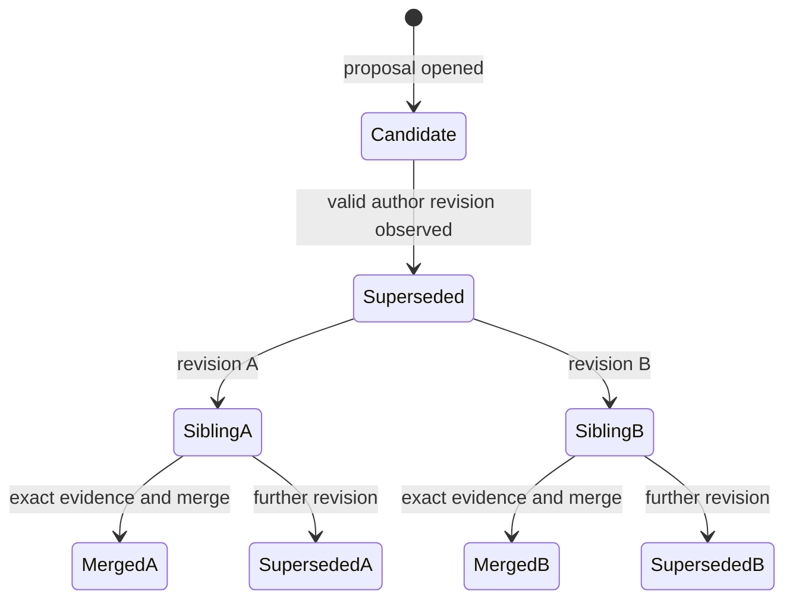

# Mission Specification: Proposal Revision and Conflict Recovery

**Mission Branch**: `chore/spec-kitty-bootstrap`  
**Created**: 2026-08-29  
**Status**: Ready for planning  
**Input**: Add immutable proposal revisions so authors can recover from merge conflicts without rewriting signed history.

## Intent Summary

A proposal author whose proposed change no longer merges cleanly resolves the
change against a new base and publishes a new proposal revision. The revision
names its exact predecessor while the predecessor and all of its evidence remain
unchanged and inspectable. Review, CI, policy evaluation, and acceptance begin
again for the revised proposal. If the author produces multiple successors for
one predecessor, all remain visible as sibling revisions and every operation
names an explicit proposal; Nichthub does not invent a global latest revision.

## User Scenarios & Testing *(mandatory)*

### User Story 1 - Recover a Conflicted Proposal (Priority: P1)

As a proposal author, I want to publish my resolved change as a revision of the
original proposal so collaborators retain the full history and can review the
new exact change.

**Why this priority**: Without this path, an ordinary merge conflict ends the
proposal workflow and forces users to abandon its context manually.

**Independent Test**: Start with an unmerged proposal whose target has diverged,
resolve the change onto the new target state, publish a revision, and verify the
old and new proposals are both independently inspectable.

**Acceptance Scenarios**:

1. **Given** an unmerged proposal that conflicts with the current target state,
   **when** its author publishes a resolved base and head as a proposal revision,
   **then** the new proposal identifies the predecessor exactly and the
   predecessor remains byte-for-byte unchanged.
2. **Given** a valid proposal revision, **when** collaborators evaluate it,
   **then** no review, CI result, acceptance, or policy digest attached to the
   predecessor counts toward the revision.
3. **Given** a proposal authored by one actor, **when** a different actor tries
   to present a successor as its revision, **then** the attempted revision is
   rejected as unauthorized while an independent proposal remains possible.
4. **Given** a merge attempt that conflicts, **when** the attempt fails,
   **then** the worktree is restored and the user receives enough predecessor
   context to begin conflict recovery without altering the proposal.

---

### User Story 2 - Review Exact Revision Evidence (Priority: P1)

As a reviewer or maintainer, I want lineage and evidence shown per exact
proposal so I never approve or merge code based on stale evidence.

**Why this priority**: Carrying evidence across changed code would break the
protocol's central trust claim.

**Independent Test**: Approve and run CI for a predecessor, create a revision,
and verify the revision remains unready until its own required review, CI, and
acceptance evidence exists.

**Acceptance Scenarios**:

1. **Given** a predecessor with passing review and CI evidence, **when** a
   revision is created, **then** the revision reports zero qualifying inherited
   evidence and clearly distinguishes historical predecessor evidence.
2. **Given** a revision with newly gathered evidence, **when** its readiness is
   evaluated, **then** policy comes from the revision's exact base and every
   qualifying event binds the revision's exact identity and head.
3. **Given** a locally known valid successor, **when** a maintainer attempts a
   new acceptance or merge of its predecessor, **then** the operation refuses
   and identifies the successor relationship.

---

### User Story 3 - Preserve Sibling Revisions (Priority: P2)

As a distributed collaborator, I want multiple revisions of one predecessor
preserved as siblings so synchronization never discards signed work or pretends
there was a globally ordered latest edit.

**Why this priority**: Offline creation is a defining protocol boundary, so a
central winner-selection rule would contradict the product.

**Independent Test**: Create two author-signed revisions of the same predecessor,
deliver them to peers in different orders, and verify every peer converges on
the same visible sibling set.

**Acceptance Scenarios**:

1. **Given** two valid author-signed revisions of the same predecessor, **when**
   peers learn them in different orders, **then** both remain valid sibling
   candidates and neither is silently discarded or labeled globally latest.
2. **Given** sibling revisions, **when** a user reviews, accepts, merges, or
   further revises one, **then** the user names an exact proposal identity and
   the other sibling remains independently inspectable.
3. **Given** one member of a revision lineage has merged, **when** another
   unmerged sibling is evaluated in a view that knows that merge, **then** it is
   no longer eligible for acceptance or merge and the merged lineage member is
   reported.
4. **Given** disconnected repositories independently merge competing siblings,
   **when** their event histories later meet, **then** Nichthub exposes the
   conflicting merge history and does not rewrite or silently select one result.

---

### User Story 4 - Preserve Existing Proposal Behavior (Priority: P2)

As an existing Nichthub user, I want proposals without revision relationships to
keep their current behavior so the protocol extension does not invalidate prior
history.

**Why this priority**: Repository-carried collaboration data must remain useful
across client upgrades.

**Independent Test**: Replay repositories containing only the current proposal,
review, run, decision, and merge events and compare all visible results with the
pre-feature behavior.

**Acceptance Scenarios**:

1. **Given** a repository containing no proposal revisions, **when** it is read
   by the revised client, **then** proposal listing, status, review, decision,
   synchronization, and merge behavior remain unchanged.
2. **Given** a repository containing both legacy proposals and revised
   proposals, **when** collaborators synchronize it, **then** both histories are
   discoverable through the existing repository-native transport boundary.

### Revision Lifecycle

Each candidate has its own immutable identity and evidence. The diagram shows
possible lineage, not a global clock: sibling order is intentionally undefined.
Once a merge is visible anywhere in the lineage, other locally visible
candidates are closed to new acceptance and merge operations.

### Edge Cases

- A predecessor is missing, malformed, unsigned, or unavailable after a partial
  fetch: the claimed revision is not trusted until the predecessor is verified.
- A revision points to itself or creates a cycle: lineage validation rejects it.
- A non-author signs a claimed revision: it is not part of the predecessor's
  revision lineage, even if its code is otherwise valid.
- A revision changes both base and head: its policy and evidence are evaluated
  entirely from the new base and exact new head.
- A local revision is attempted for a proposal already known merged: creation is
  refused and a new independent proposal is required. If synchronization later
  reveals both a valid revision and a merge fact, both remain visible and the
  lineage is closed or conflicted according to the known merge facts.
- An accepted but unmerged predecessor gains a revision: its historical
  acceptance remains visible, but it is no longer locally mergeable.
- A rejected or changes-requested predecessor gains a revision: the revision is
  a fresh candidate and prior negative review remains historical context only.
- Multiple generations and sibling forks exist: lineage views remain finite,
  cycle-safe, and deterministic regardless of event arrival order.
- A revision is created locally but publication fails: no existing proposal or
  proposal reference is changed, and retrying cannot create conflicting bytes
  for the same signed revision identity.

## Domain Language

- **Proposal**: An immutable signed request to evaluate one exact head relative
  to one exact base.
- **Proposal revision**: A new immutable proposal with exactly one predecessor,
  a newly resolved base and head, and fresh evidence requirements.
- **Sibling revision**: One of multiple valid revisions naming the same direct
  predecessor. Siblings are peers; none is implicitly current or latest.
- **Superseded proposal**: An unmerged proposal for which a valid author-signed
  revision is locally known. It remains historical but cannot receive a new
  local acceptance or merge.
- **Proposal evidence**: Signed review, run, policy, decision, or merge facts
  bound to one exact proposal. Evidence never transfers to a revision.
- **Conflict recovery**: Resolving divergence onto a new base and publishing the
  resulting head as a proposal revision.
- Avoid **amend**, **update**, and **latest proposal** when they imply mutation or
  a total ordering. Use **proposal revision**, **predecessor**, and **sibling**.

## Requirements *(mandatory)*

### Functional Requirements

| ID | Requirement | Priority | Status |
|----|-------------|----------|--------|
| FR-001 | An author can create a proposal revision from any verified, unmerged proposal they originally authored, using a newly selected exact base and exact head. | High | Open |
| FR-002 | Every proposal revision identifies exactly one predecessor proposal and is valid only when signed by the predecessor's author. | High | Open |
| FR-003 | Creating or receiving a proposal revision preserves the predecessor event, code reference, evidence, and display history without mutation. | High | Open |
| FR-004 | A valid locally known revision marks its unmerged predecessor superseded and prevents new local acceptance or merge of that predecessor. | High | Open |
| FR-005 | Reviews, run requests, run results, policy digests, acceptances, and rejections count only for the exact proposal identity and exact code or policy inputs they bind; none transfer to a revision. | High | Open |
| FR-006 | Revision readiness is evaluated against the policy in the revision's exact base, including fresh review, CI, and acceptance requirements. | High | Open |
| FR-007 | Proposal list, show, and status views identify predecessors, successors, sibling revisions, superseded state, and any merged member of the lineage without hiding historical evidence. | High | Open |
| FR-008 | Multiple valid revisions of one predecessor remain visible sibling candidates, with no inferred global latest or automatic winner. | High | Open |
| FR-009 | Any review, CI, decision, merge, or further-revision operation in an ambiguous sibling lineage requires an explicit proposal identity. | High | Open |
| FR-010 | A proposal revision can itself be revised, preserving a directed, acyclic, multi-generation lineage. | Medium | Open |
| FR-011 | Once a merge is locally known anywhere in a revision lineage, other unmerged lineage candidates are locally ineligible for new acceptance or merge. | High | Open |
| FR-012 | If independently merged sibling histories are later synchronized, both signed merge facts remain visible and the lineage reports a conflict rather than choosing or deleting one. | High | Open |
| FR-013 | Self-links, cycles, missing or unverifiable predecessors, and unauthorized revision signers are rejected with actionable reasons; locally creating a revision of a proposal already known merged is refused. | High | Open |
| FR-014 | A failed conflicting merge continues to restore the prior clean worktree and identifies the proposal needed to start a revision workflow. | High | Open |
| FR-015 | Proposals with no revision relationships retain their existing listing, review, CI, decision, synchronization, and merge semantics. | High | Open |
| FR-016 | Proposal revisions and their code remain exchangeable through the same repository-native synchronization boundary as existing collaboration history. | High | Open |

### Non-Functional Requirements

| ID | Requirement | Category | Priority | Status |
|----|-------------|----------|----------|--------|
| NFR-001 | Two repositories containing the same verified events must derive identical revision lineage, sibling sets, superseded states, and merge-conflict states in 100% of deterministic replay tests, regardless of event arrival order. | Determinism | High | Open |
| NFR-002 | All test cases containing altered signatures, altered predecessor identities, unauthorized signers, cycles, or mismatched code identities must be rejected; no invalid case may influence readiness or merge eligibility. | Security | High | Open |
| NFR-003 | On a representative local repository containing 10,000 collaboration events, 1,000 proposals, and 100 revision links, proposal list, show, and status operations must complete within 2 seconds on the project's reference development machine. | Performance | Medium | Open |
| NFR-004 | In 100% of injected failures before successful revision publication, existing proposal events and references remain unchanged and a retry produces either the same signed revision identity or a separate fully valid revision. | Reliability | High | Open |
| NFR-005 | All pre-mission proposal, review, CI, governance, synchronization, and merge acceptance tests must pass unchanged against histories without revisions. | Compatibility | High | Open |
| NFR-006 | Every user-visible ambiguous-lineage or blocked-operation result must include the exact proposal identities needed to inspect or continue the workflow. | Usability | High | Open |

### Constraints

| ID | Constraint | Category | Priority | Status |
|----|------------|----------|----------|--------|
| C-001 | Revision history and evidence remain signed, content-addressed repository data transported with Git; no hosted coordinator or service database is required. | Product boundary | High | Open |
| C-002 | Signed proposal and evidence history is immutable. Recovery adds successor facts and never rewrites an existing event or identity. | Integrity | High | Open |
| C-003 | Only the original proposal author can extend that proposal's revision lineage; other actors create independent proposals. | Authorization | High | Open |
| C-004 | No Docker dependency is introduced. Core collaboration remains usable anywhere the existing Git-based client works. | Deployment | High | Open |
| C-005 | Sibling revisions have no protocol-level total order, latest pointer, or automatic winner; users and evidence always target explicit identities. | Distributed semantics | High | Open |
| C-006 | Evidence from one proposal identity never satisfies another proposal identity, even when their content or lineage is related. | Trust | High | Open |

### Key Entities

- **Proposal**: Immutable signed base/head request with an author and code
  identity.
- **Proposal revision**: A proposal plus one exact predecessor relationship;
  it owns independent policy evaluation and evidence.
- **Revision lineage**: The directed acyclic set of predecessor/successor
  relationships rooted at an original proposal.
- **Sibling set**: Valid proposals sharing one direct predecessor.
- **Proposal evidence**: Exact-proposal reviews, CI requests and results,
  decisions, policy digests, and merge facts.
- **Lineage state**: Locally derived candidate, superseded, merged, or
  conflicting-merge status based only on verified known events.

## Scope Boundaries

### In Scope

- Author-created proposal revisions after merge conflicts, review feedback, or
  other code changes.
- Immutable predecessor links, multi-generation lineage, and sibling forks.
- Fresh evidence and policy evaluation per exact revision.
- Lineage-aware listing, inspection, readiness, acceptance, and merge safety.
- Repository-native synchronization and backward-compatible history reading.
- Documentation of the revision wire semantics and conflict-recovery workflow.

### Out of Scope

- Automatic Git conflict resolution or an interactive merge editor.
- A global consensus service, mutable latest pointer, or server-selected winner.
- Rewriting, retracting, or deleting signed history.
- Undoing an already completed Git merge.
- Key rotation, shared identities, and multiple writers intentionally using one
  private identity.
- Concurrent publication from disconnected clones sharing one private identity;
  the sibling model supports multiple successors without changing the actor
  history's existing single-writer invariant.
- Merge queues, cross-repository proposals, moderation, redaction, or selective
  replication.

## Dependencies and Assumptions

- Existing proposal, review, CI, policy decision, merge, code-reference, and
  synchronization behavior remains the foundation.
- The actor that signed the predecessor is its author; key rotation is outside
  this mission.
- Sibling revisions are multiple author-signed successors of one predecessor.
  They may be created through separate local workspaces, but their publication
  remains serialized through the author's existing single-writer event chain.
- “Superseded” is derived from the locally verified event view. A disconnected
  peer cannot react to a revision or merge it has not received.
- A merge completed before a peer learns of a sibling remains immutable history.
  Synchronization reports competing merge facts instead of retroactively
  pretending either did not happen.
- Event timestamps and delivery order do not prove whether a remote revision or
  merge happened first. Reception therefore preserves both otherwise valid
  signed facts; the locally known merge state governs future terminal actions.
- Rejected and accepted-but-unmerged proposals may be revised; merged proposals
  may not.
- The existing safe merge-abort behavior remains authoritative for restoring a
  clean worktree after conflict.

## Success Criteria *(mandatory)*

### Measurable Outcomes

- **SC-001**: An author can recover a conflicted unmerged proposal by publishing
  one linked revision while both the original and revised proposal remain fully
  inspectable.
- **SC-002**: When peers receive the same valid sibling revisions in different
  orders, synchronization preserves 100% of them and every peer derives the
  same sibling set without a global latest designation.
- **SC-003**: In all acceptance tests, zero predecessor reviews, CI results,
  policy digests, or decisions count toward a revision.
- **SC-004**: In all authorization and tampering tests, zero invalid or
  unauthorized revision relationships affect readiness or merge eligibility.
- **SC-005**: All existing histories without proposal revisions produce the same
  observable proposal and merge outcomes as before the mission.
- **SC-006**: Users can identify the predecessor, every known sibling, exact
  evidence state, and next valid action from proposal inspection without
  consulting repository internals.
- **SC-007**: Representative local lineage inspection remains under 2 seconds at
  the event and proposal volumes defined by NFR-003.
