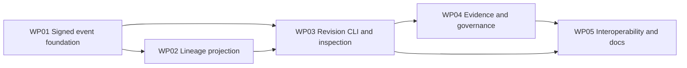

# Tasks: Proposal Revision and Conflict Recovery

**Mission**: `proposal-revision-conflict-recovery-01M1774Q`  
**Planning base**: `chore/spec-kitty-bootstrap`  
**Merge target**: `chore/spec-kitty-bootstrap`

## Delivery Shape

This mission is split into five focused, test-first work packages. Each package
owns a disjoint file surface. Status is event-sourced through Spec Kitty; the
subtask rows below are references, not checkboxes.

## Subtask Index

| ID | Description | WP | Parallel |
|---|---|---|---|
| T001 | Add red wire-shape tests for `proposal.revise` | WP01 | No |
| T002 | Implement proposal-candidate classification and revision content validation | WP01 | No |
| T003 | Add red cross-event authorization and graph-safety tests | WP01 | No |
| T004 | Validate revision predecessor, author, self-link, and cycle relationships | WP01 | No |
| T005 | Prove malformed revisions fail closed and legacy event validation remains unchanged | WP01 | No |
| T006 | Add red deterministic lineage-query tests | WP02 | No |
| T007 | Implement the derived lineage index and traversal API | WP02 | No |
| T008 | Derive superseded, closed-lineage, merged, and merge-conflict states | WP02 | No |
| T009 | Prove arrival-order convergence and representative projection performance | WP02 | No |
| T010 | Add red CLI tests for author-created immutable revisions | WP03 | No |
| T011 | Implement `nh proposal revise` and failure-safe code-ref publication | WP03 | No |
| T012 | Generalize proposal/review boundaries to exact revision candidates | WP03 | No |
| T013 | Add lineage-aware proposal list/show output with exact actionable IDs | WP03 | No |
| T014 | Prove predecessor evidence never satisfies a revision | WP04 | No |
| T015 | Generalize policy evaluation/status to revisions and lineage state | WP04 | No |
| T016 | Generalize CI request/result validation to exact revisions | WP04 | Yes |
| T017 | Block stale acceptance with exact successor or merged-lineage IDs | WP04 | No |
| T018 | Block stale merge, preserve competing merge facts, and improve conflict recovery output | WP04 | No |
| T019 | Add governance regression tests for legacy proposals and distributed merge conflicts | WP04 | No |
| T020 | Prove revision events and code exchange through an ordinary bare Git remote | WP05 | No |
| T021 | Prove delivery-order convergence and unchanged legacy synchronization | WP05 | No |
| T022 | Document the revision wire, validation, and synchronization contract | WP05 | Yes |
| T023 | Document conflict recovery, sibling, evidence, and governance behavior | WP05 | Yes |
| T024 | Run and record the full charter quality gate | WP05 | No |

## Work Packages

### WP01 — Signed Revision Event Foundation

- **Priority**: P1 foundational
- **Goal**: Make `proposal.revise` a signed, fail-closed protocol fact with
  deterministic relationship validation.
- **Independent test**: Construct valid and hostile stored revisions and verify
  only authorized acyclic predecessor links enter the event projection, while
  histories without revisions behave exactly as before.
- **Prompt**: `tasks/WP01-signed-revision-event-foundation.md`
- **Dependencies**: none
- **Estimated prompt size**: ~250 lines
- **Risks**: Cross-event checks must not depend on timestamp or iteration order;
  a later merge fact must not retroactively erase a valid received revision.

T001 Add red wire-shape tests for `proposal.revise` (WP01)
T002 Implement proposal-candidate classification and revision content validation (WP01)
T003 Add red cross-event authorization and graph-safety tests (WP01)
T004 Validate revision predecessor, author, self-link, and cycle relationships (WP01)
T005 Prove malformed revisions fail closed and legacy event validation remains unchanged (WP01)

### WP02 — Deterministic Revision Lineage Projection

- **Priority**: P1 foundational
- **Goal**: Provide one deep module for deterministic lineage queries and
  locally derived safety state.
- **Independent test**: Feed identical verified candidates and merge facts in
  multiple orders and obtain identical roots, siblings, successors, states, and
  conflicting-merge identities.
- **Prompt**: `tasks/WP02-deterministic-lineage-projection.md`
- **Dependencies**: WP01
- **Estimated prompt size**: ~240 lines
- **Risks**: Timestamps and arrival order are presentation data only; traversal
  must remain finite and near-linear.

T006 Add red deterministic lineage-query tests (WP02)
T007 Implement the derived lineage index and traversal API (WP02)
T008 Derive superseded, closed-lineage, merged, and merge-conflict states (WP02)
T009 Prove arrival-order convergence and representative projection performance (WP02)

### WP03 — Revision Creation and Lineage Inspection

- **Priority**: P1 user story
- **Goal**: Let the author publish a fresh immutable revision and let users
  inspect exact predecessor/successor/sibling relationships.
- **Independent test**: Create a revision from a conflicted predecessor, verify
  immutable old/new refs and author checks, then inspect both candidates through
  public CLI output.
- **Prompt**: `tasks/WP03-revision-creation-and-inspection.md`
- **Dependencies**: WP01, WP02
- **Estimated prompt size**: ~260 lines
- **Risks**: Event append and code-ref creation cross a transaction boundary;
  output must remain useful if publication partially succeeds.

T010 Add red CLI tests for author-created immutable revisions (WP03)
T011 Implement `nh proposal revise` and failure-safe code-ref publication (WP03)
T012 Generalize proposal/review boundaries to exact revision candidates (WP03)
T013 Add lineage-aware proposal list/show output with exact actionable IDs (WP03)

### WP04 — Exact Evidence and Lineage-Safe Governance

- **Priority**: P1 trust boundary
- **Goal**: Evaluate reviews, CI, policy, decisions, and merge strictly against
  the selected revision and prevent locally stale terminal actions.
- **Independent test**: Give a predecessor complete evidence, create a revision,
  verify the revision starts blocked, then gather fresh evidence and prove only
  the explicit eligible lineage member can be accepted and merged.
- **Prompt**: `tasks/WP04-exact-evidence-and-governance.md`
- **Dependencies**: WP01, WP02, WP03
- **Estimated prompt size**: ~330 lines
- **Parallel opportunities**: T016 can be developed independently inside the
  lane before the final integration pass.
- **Risks**: Never traverse lineage edges when selecting evidence; preserve
  immutable facts when disconnected merge histories later meet.

T014 Prove predecessor evidence never satisfies a revision (WP04)
T015 Generalize policy evaluation/status to revisions and lineage state (WP04)
T016 [P] Generalize CI request/result validation to exact revisions (WP04)
T017 Block stale acceptance with exact successor or merged-lineage IDs (WP04)
T018 Block stale merge, preserve competing merge facts, and improve conflict recovery output (WP04)
T019 Add governance regression tests for legacy proposals and distributed merge conflicts (WP04)

### WP05 — Git Interoperability, Documentation, and Acceptance Proof

- **Priority**: P2 integration
- **Goal**: Prove the completed feature crosses the unchanged Git transport
  boundary and ship protocol/governance/user documentation with full quality
  evidence.
- **Independent test**: Exchange revisions and code through a real temporary
  bare remote, inspect equivalent lineage after different observation orders,
  and pass every charter gate without Docker or a service.
- **Prompt**: `tasks/WP05-interoperability-docs-and-quality.md`
- **Dependencies**: WP03, WP04
- **Estimated prompt size**: ~280 lines
- **Parallel opportunities**: T022 and T023 touch separate documentation files
  and can proceed after behavior is stable.
- **Risks**: Tests must exercise real Git refs instead of mocks and must not
  imply unsupported concurrent same-identity publication.

T020 Prove revision events and code exchange through an ordinary bare Git remote (WP05)
T021 Prove delivery-order convergence and unchanged legacy synchronization (WP05)
T022 [P] Document the revision wire, validation, and synchronization contract (WP05)
T023 [P] Document conflict recovery, sibling, evidence, and governance behavior (WP05)
T024 Run and record the full charter quality gate (WP05)

## Dependency Flow

The MVP behavioral slice is WP01 through WP03: signed immutable revisions and
inspectable lineage. WP04 is mandatory before any production-like use because
it closes the evidence and merge-safety boundary; WP05 supplies mission-level
interoperability and acceptance proof.
